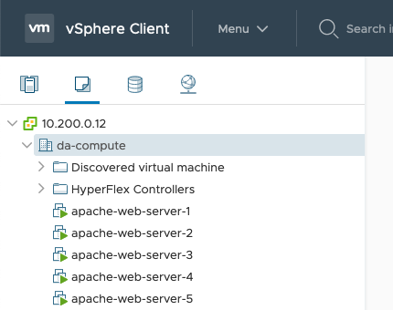
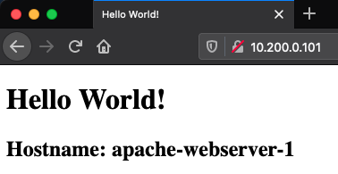
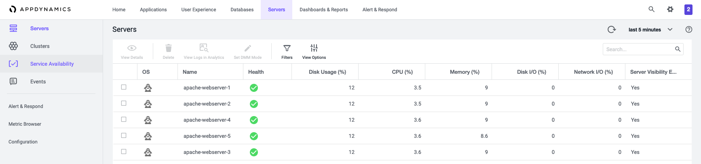
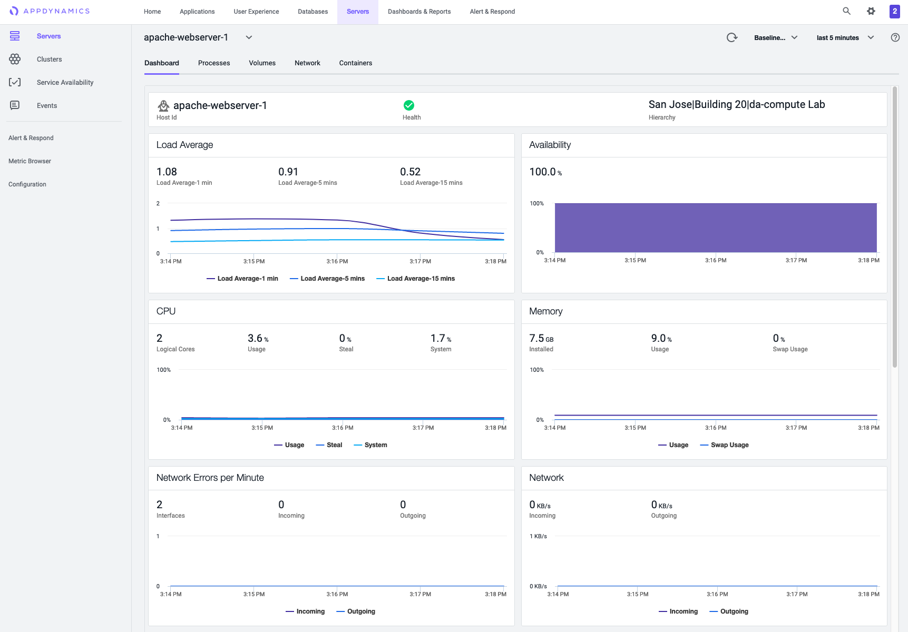
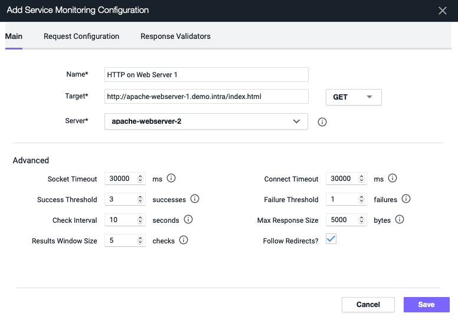
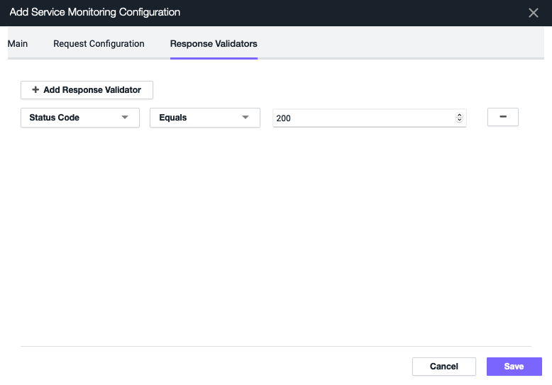
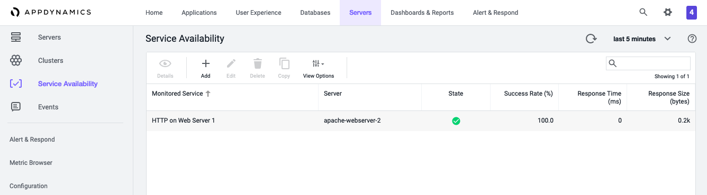
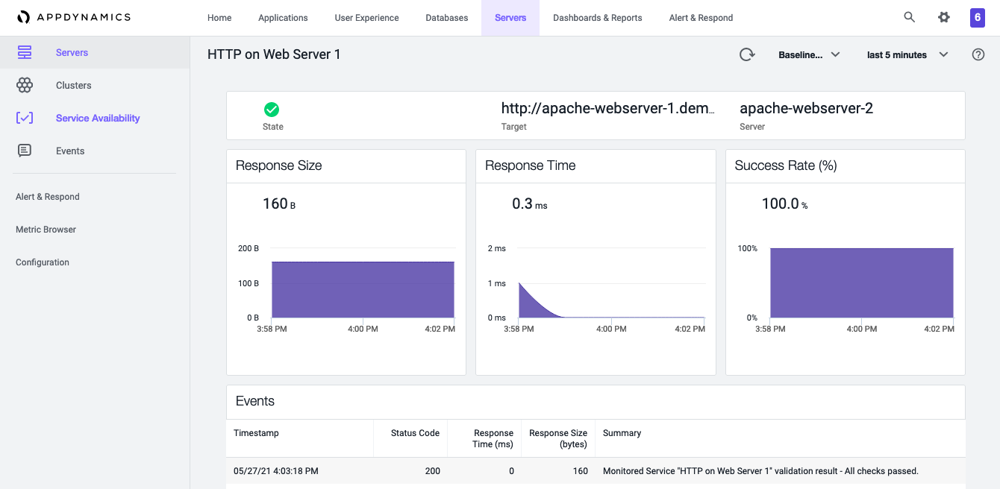

# Automated deployment of virtual machines and AppDynamics Machine Agent
 This solution is an example of how to get started with monitoring and observability using AppDynamics's Machine Agent. The example details how to use Terraform to deploy 5 virtual machines in vSphere followed by the installation of Apache and the AppDynamics Machine Agent using Ansible. After Terraform provisions the virtual machines, a provisioner within Terraform calls the Ansible playbook which installs Apache, Docker, and the AppDynamics Machine Agent.

The main objective is to get you started with monitoring your infrastructure by showing you an automated way of getting the AppDynamics agent installed so that you have observability baked into your environment from the onset. We first start with the use case of monitoring virtual machines with follow-on use cases showing how Kubernetes clusters, databases, and applications are brought into the fold to ultimately provide a full-stack view of your operations in real time.

## Requirements

Here is a list of dependencies to make this work in your environment:

- vSphere 6.7 or higher
- Terraform v0.15.2 or higher
- Ansible 2.10.2
- AppDynamics controller instance along with its credentials
- A virtual machine template with CentOS 8.2 installed as the guest OS

## Credentials

We purposely did not add credentials and other sensitive information to the repo by including them in the `.gitignore` file. As such, if you clone this repo, you will need to create two files. The first file named `secret.tfvars` contains sensitive Terraform variables. The second file named `variables.yml` is used by Ansible. In this scenario, we encrypted `variables.yml` using the command `ansible-vault` command and decrypt it as needed locally. You could take the same approach or leave the file unencrypted if you are confident it won't be shared or inadvertently uploaded to a repo.

Here is a list of variables you'll need to include and define for each file

- `secret.tfvars` in HCL format (file is in the same directory as the `terraform.tfvars` file):
  - vsphere_user
  - vsphere_password
  - vsphere_server (the IP address or FQDN)
  - vsphere_vm_firmware (default is `vsphere_vm_firmware = bios`)
  - ssh-pub-key (an SSH key used with a service account that allows Ansible to connect over SSH)
  - service_account_username
  - service_account_password
- `variables.yml` (written in YAML) file:
  - CONTROLLER_HOST (the URI of the AppDynamics Controller)
  - CONTROLLER_PORT (typically 443)
  - ACCOUNT_NAME (AppDynamics Account Name)
  - MACHINE_PATH (This is a heirarchy separated with a |. For example: San Jose|Rack1|)
  - ACCOUNT_ACCESS_KEY (this value is available in the AppDynamics Controller)
  - APPD_BEARER_TOKEN (this is the token derived from the available image download via cURL)

## What Terraform Provisions

In this example, Terraform uses the `vsphere` provider and a `vsphere_virtual_machine` resource to:

- Create 5 virtual machines from virtual machine template
- Add the SSH key of a service account to each host
- Run an Ansible playbook that performs the steps in the next section

## What Ansible Installs and Configures

After Terraform creates 5 virtual machines, the Ansible playbook installs and configures:

- Apache Web Server
- Firewall with port 80 opened
- Docker
- DNS (resolv.conf is configured)
- AppDynamics Machine Agent

Each Apache Web Server is configured with a custom (using a Jinja template) `index.html` page that displays the hostname.

The same approach is taken with the AppDynamics Machine Agent. In other words, a Jinja template creates a custom file for each containing the hostname.

## Creating and Applying the Terraform Plan

Here are the steps needed to run Terraform along with examples of each:

1. Initialize Terraform:
    
`terraform init  -var-file="secret.tfvars"`

2. Create a Terraform Plan:

`terraform plan -out appd-machine-agent-installation.tfplan -var-file="secret.tfvars"`

3. Apply the Terraform Plan:

`terraform apply -var-file="secret.tfvars"`

Each of these commands includes the `secret.tfvars` containing the sensitive variables needed to connect to the different resources as described in the previous section.

## Results

### Virtual Machines

You will see 5 virtual machines created with static IP addresses in vSphere.

### Apache Web Servers

Each Apache server has a custom `index.html` file that includes the hostname of the machine.

### AppDynamics Controller

The 5 virtual machines also appear in the AppDynamics controller, each running an Apache Web Server, and all 5 appearing in the AppDynamics controller.

Click the check box next to any of the servers and then click `View Details` to see the data reported by the Machine Agent to the AppDynamics Controller. In the example below, we see data reported by the Machine Agent on `apache-webserver-1`.

### Extra Credit

Now that you have an Apache Web Server running and you have a Machine Agent onboard your newly created hosts, you can monitor HTTP as a service. Here's how:

- Click `Servers` on the top navigation bar followed by `Service Availability` on the left hand side of the AppDynamics controller user interface.
- Click `Add`
- Enter a name for the service availability check (see the values we used in the example below)
- Enter a target address (a FQDN is needed to an A record in DNS is needed)
- Select the server that is runs the check. In this case, we used `apache-web-server-2` to run a check against the HTTP service running on `apache-web-server-1`.

- Next, click the `Response Validtor` tab followed by selecting `Add Response Validator`
- Keep `Status Code` and select `Equals` for the condition followed by entering a value of `200`. Explore the other options to see how many other Response Validators you can come up with. We chose a HTTP response of 200 to keep things simple but there are so many others to choose from. See the example below.
- Click Save

After saving the configuration, you are returned to the Service Availability page where you will see your newly created Service Availability check displayed. After a few minutes, you will data about the service reported back by the machine agent as it periodically checks the health of the HTTP service running on `apache-webserver-1`. The server running the check is listed under the `Server` column and the monitored service is listed in the `Monitored Service` column.

To see details about the service, click the click the service and click `Details`.

